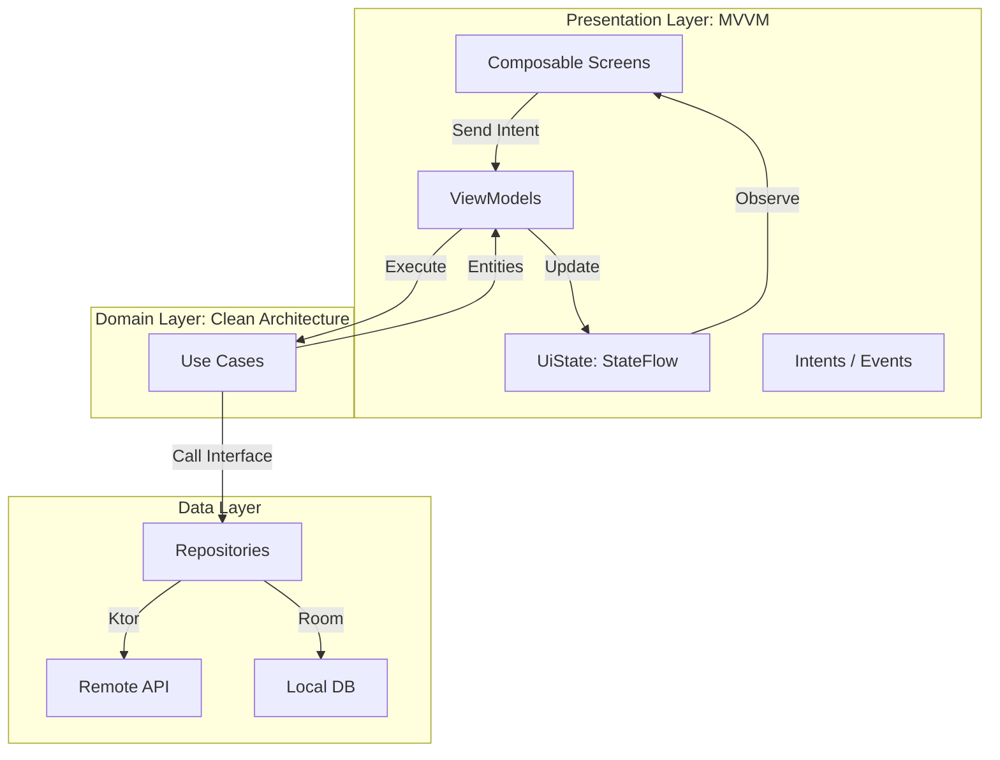

# 📱 GitHub Explorer

**GitHub Explorer** — это современное кроссплатформенное мобильное приложение для работы с GitHub, разработанное с использованием **Compose Multiplatform (CMP)** и **Clean Architecture**. Приложение позволяет авторизоваться через OAuth, искать репозитории, просматривать исходный код, создавать Issues, работать с избранным в офлайн-режиме и многое другое.

## ✨ Ключевые возможности

✅ **Полностью реализовано:**

- **🔐 Безопасная авторизация (OAuth):** Интеграция с GitHub OAuth через платформенные API (`expect/actual`). Безопасное хранение токена и автоматический сброс сессии при ошибке 401.
    
- **🧭 Навигация:** Bottom Navigation с тремя основными разделами: Поиск (Репозитории), Избранное и Профиль.
    
- **👋 Онбординг:** Информативная карусель при первом запуске приложения.
    
- **🔍 Поиск и просмотр репозиториев:** Поиск с поддержкой пагинации, отображением языка, количества звезд и владельца.
    
- **📄 Детали репозитория:** Просмотр README (рендеринг Markdown), навигация по структуре файлов, просмотр списков issues и форков (включая базовую поддержку Pull Requests).
    
- **📝 Взаимодействие с репозиторием:** * Создание новых Issue с прямой отправкой на сервер GitHub.
    
    - Загрузка файлов в репозиторий (с кодированием содержимого в Base64).
        
- **⭐ Офлайн Избранное:** Локальное сохранение репозиториев с использованием базы данных Room KMP для доступа без интернета.
    
- **👤 Профиль пользователя:** Отображение аватара, био, статистики (подписчики, репозитории) и возможность безопасного выхода (Logout).
    
- **⚙️ Общие UX/UI требования:** * Глобальная обработка состояний (`loading` / `error` / `empty`) на всех экранах.
    
    - Централизованная обработка сетевых ошибок (`AppError`: 401, 403, 500, отсутствие сети).
        
    - Поддержка двух языков (RU / EN) через ресурсы CMP.
        
    - Полная поддержка Material 3 Dark Theme.
        

⚠️ **Реализовано частично (в процессе доработки):**

- **Офлайн-режим поиска:** Сами данные кэшируются и доступны без сети, однако требуется доработка UI (добавление баннера _"Показаны сохранённые данные"_).
    
- **Просмотр кода:** Структура файлов и README отображаются корректно, но просмотр сырого кода в остальных текстовых файлах пока не поддерживает продвинутый синтаксический хайлайтинг (Code Highlighting).
    

❌ **В планах на будущие релизы:**

- **Push-уведомления:** Интеграция Firebase Cloud Messaging (FCM) + Webhooks от GitHub, либо реализация фонового опроса через WorkManager (Notifications API).
    
- **Diff коммитов:** Добавление экрана для просмотра разницы между коммитами.
    

## 🛠 Технологический стек и Архитектура

Схема архитектуры:

Проект построен на базе **Clean Architecture** со строгим разделением на слои (Data, Domain, Presentation) и использованием паттерна **MVVM**. UI и основная бизнес-логика вынесены в `commonMain` благодаря Compose Multiplatform.

- **UI Framework:** Compose Multiplatform (CMP)
    
- **Архитектура:** Clean Architecture, MVVM, Repository Pattern, UseCases
    
- **Асинхронность:** Kotlin Coroutines, Flow / StateFlow
    
- **DI (Внедрение зависимостей):** Koin
    
- **Сеть:** Ktor, Kotlin Serialization
    
- **Локальная БД:** Room KMP (офлайн хранение избранного)
    
- **Настройки / Токены:** DataStore / AppSettings (`TokenManager`)
    
- **SDK:** Target SDK 35, Min SDK 23
    

## 📋 API и Документация

В приложении используется официальное [GitHub REST API](https://docs.github.com/en/rest).

- Для авторизации используется [GitHub OAuth Apps API](https://docs.github.com/en/apps/oauth-apps/building-oauth-apps/authorizing-oauth-apps).
    
- Для работы приложения необходимо зарегистрировать свой OAuth App в настройках разработчика на GitHub и прокинуть `Client ID` и `Client Secret` в проект.
    

## 🚀 Итоги разработки

Текущая версия приложения представляет собой стабильный и масштабируемый клиент GitHub. Переход на Compose Multiplatform позволил унифицировать UI и бизнес-логику. Основной фокус для будущих обновлений направлен на реализацию механизма фоновых уведомлений для достижения 100% покрытия как основного, так и дополнительного функционала.
